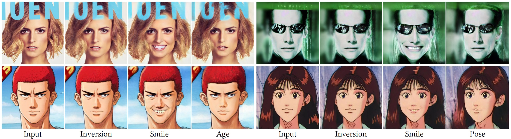

# Cycle Encoding of a StyleGAN Encoder for Improved Reconstruction and Editability

<p align="center">

</p>

## Description   
Official Implementation of "<a href="https://arxiv.org/abs/2207.09367">Cycle Encoding of a StyleGAN Encoder for Improved Reconstruction and Editability</a>" paper.

## Prerequisites and Installation
Please refer to the Prerequisites and Installation in <a href="https://github.com/danielroich/PTI">PTI</a>.

## Pretrained Models
Please download the pre-trained models from the following links. We assume that all auxiliary models are downloaded and saved to the directory `pretrained_models`.

| Link 
| :--- 
|[FFHQ CycleEncoding Inversion](https://drive.google.com/file/d/1_AfQgD0J9cHsHDra18BjlnUgHN6RdbTu/view)

Please also download the auxiliary models from <a href="https://github.com/omertov/encoder4editing">e4e</a>.

## Inversion

### Method 1: Cycle Encoding + Pivotal Tuning
As described in the paper, this method is faster than the second method. Please perform the following steps:

```
cd pivotal_tuning
```
Edit "configs/hyperparameters.py" and set "use_saved_w_pivots = False" and "first_inv_type = 'cycle'".
```
sh run_pivotal_tuning.sh
```

### Method 2: Cycle Encoding + Refinement + Pivotal Tuning
This method achieves better reconstruction quality than the first method. Please perform the following steps:

```
cd refinement
sh run_regularized_refinement.sh
```
Copy or link the directory `saved_w` to the directory `pivotal_tuning`.
```
cd pivotal_tuning
```
Edit "configs/hyperparameters.py" and set "use_saved_w_pivots = True".
```
sh run_pivotal_tuning.sh
```

## Training

### Train W -> W+
```
cd cycle_encoding/w_to_wplus
sh run_w_to_wplus.sh
```
### Train W+ -> W
```
cd cycle_encoding/wplus_to_w
sh run_wplus_to_w.sh
```

## Quantitative Evaluation
We used the scripts <a href="https://github.com/eladrich/pixel2style2pixel/blob/master/scripts/calc_id_loss_parallel.py">calc_id_loss_parallel.py
</a> and <a href="https://github.com/eladrich/pixel2style2pixel/blob/master/scripts/calc_losses_on_images.py">calc_losses_on_images.py</a> from <a href="https://github.com/eladrich/pixel2style2pixel">pSp</a> for quantitative evaluation. 

## Acknowledgments
The code borrows heavily from <a href="https://github.com/danielroich/PTI">PTI</a>.
Some code borrows from <a href="https://github.com/omertov/encoder4editing">e4e</a> and <a href="https://github.com/eladrich/pixel2style2pixel">pSp</a>.

## Citation

If you use this code for your research, please cite our paper:

```
@inproceedings{Xudong2022CycleEncoding,
  title={Cycle Encoding of a StyleGAN Encoder for Improved Reconstruction and Editability},
  author={Xudong Mao and Liujuan Cao and Aurele T. Gnanha and Zhenguo Yang and Qing Li and Rongrong Ji},
  booktitle={Proceedings of ACM International Conference on Multimedia},
  year={2022}
}
```


